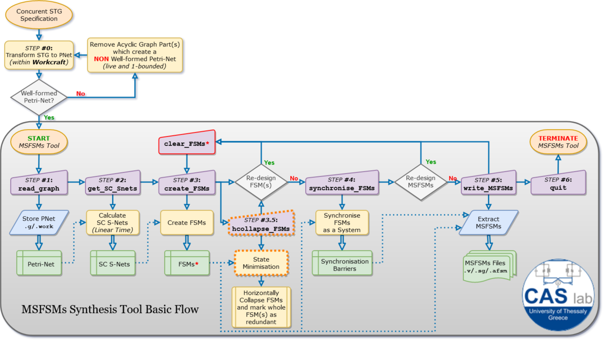

## MSFSMs Tool 2018-2020
# 

MSFSMs stands for Multiple Synchronised FSMs.

#### Research

Our work is based on:

• [1] [P. M. Mattheakis, C. P. Sotiriou, & P. A. Beerel, "A polynomial time flow for implementing free-choice Petri-nets" in 2012 IEEE 30th International Conference on Computer Design (ICCD). IEEE, 2012, pp. 227-234.](https://ieeexplore.ieee.org/document/6378645)

• [2] [P. M. Mattheakis, "Logic Synthesis of Concurrent Controller Specification", PhD thesis Presentation](https://www.csd.uoc.gr/~pmat/research/Phd.pdf)

• [3] [P. Kemper, "Linear time algorithm to find a minimal deadlock in a strongly connected free-choice net." in International Conference on Application and Theory of Petri Nets. Springer, 1993, pp. 319-338.](http://citeseerx.ist.psu.edu/viewdoc/download?doi=10.1.1.20.7958&rep=rep1&type=pdf)

• [4] [P. Kemper, "O(|P||T|)-Algorithm to Compute a Cover of S-components in EFC-nets.", 2004.](http://citeseerx.ist.psu.edu/viewdoc/download?doi=10.1.1.45.3734&rep=rep1&type=pdf)

• [5] [A. Sakellariou, D. Valiantzas, C. Sotiriou, N. Xiromeritis and N. Sketopoulos, "Linear Time S-Component Extraction for General Petri Nets," 2019 Panhellenic Conference on Electronics & Telecommunications (PACET), Volos, Greece, 2019, pp. 1-6](https://ieeexplore.ieee.org/abstract/document/8956294)

We basically extended and updated Pavlos' work, and created a closed-source free-ware available for
the community.

A major contribution of ours in [4], is the extension of Kemper's Methodology in [3]. With our
proposed methodology, the user is able to calculate S-Cover for all Well-formed Petri-Net Classes,
from State Machines and Marked Graphs to Asymmetric or even General class.

#### How to run the MSFSMs (Multiple Synchronised FSMs) Tool flow:

##### Mandatory Step(s):

  - ___step #0___  : save a Workcraft Petri Net Graph either in .work or .g format (.g is suggested)
  - ___step #1___  : run *read_graph* TCL command, to load Petri-Net structure into MSFSMs tool
  - ___step #2___  : run *get_SC_Snets* TCL command, to calculate an S-cover, and obtain an array of
              Strongly Connected S-Nets (SC-SNets) for the given Petri-Net
  - ___step #3___  : run *create_FSMs* TCL command, to implement FSM mapping of SC-SNets and obtain
              an array of MSFSMs
  - ___step #3.5___: run *horizontal_collapse_FSMs* TCL command, to implement horizontal state
              collapsing between different FSMs.
               Meaning, the tool compares FSMs with each other in order to check if they are
              equivalent to avoid mapping of redundant state
  - ___step #4___  : run *synchronise_FSMs* TCL command, to synchronise FSMs together and obtain the
              final array of the MSFSMs system
  - ___step #5___  : run *write_MSFSMs* TCL command, to generate verilog RTL code per FSM and for the
              whole MSFSMs wrapper logic

##### Optional Steps(s):

  - Edit exported .g file set input and output events or,
  - Use Level Sensitisation of Output Events related TCL commands
    - "create_complimentary_set_of_output_signal",
    - "list_complimentary_output_set_membership",
    - "list_complimentary_output_sets",
    - "delete_complimentary_output_set",
    - "get_transition_region_of_complimentary_output_set"
  - run *write_SC_Snet_to_dot* TCL command, to produce .dot file illustrating the FSMs
  correspondence, in terms of places, transitions on the original Petri Net
  - run *write_FSM_to_dot* TCL command, to display the MSFSMs using graphviz/dotty

#### All Available TCL commands in MSFSMs Tool:

    - read_graph,
        option(s): "?-format <g (default) | work> <filename>?"
        command type: mandatory flow command [step#1]
        synopsis: loads an input graph file.
        description: Input graph must be a single well formed Petri-Net. If the graph is an STG
                   should be transformed to Petri-Net before is loaded (feature available within
                   Workcraft), meaning:
                   • place nodes,
                    1) are connected only with transition nodes,
                    2) is forbidden to connect with any other place node
                   • transition nodes,
                    1) are connected only with place nodes,
                    2) is forbidden to connect with any other transition node
                   Moreover, we do NOT support and we do NOT filter out (yet):
                    • labels which indicate multiple instances of the same signal (i.e: req/1, req/2 etc.)
                    • or +/- keywords, for signals rise or fall events

    - list_petrinet,
       option(s): ""
       command type: informative command [after step#1]
       synopsis: lists all nodes of the loaded Petri-Net.

    - list_places,
       option(s): ?-all(default) | -marked | -empty?"
       command type: informative command [after step#1]
       synopsis: lists selected places of the loaded Petri-Net.

    - list_transitions,
       option(s): "?-all(default) | -input | -output?"
       command type: informative command [after step#1]
       synopsis: lists selected transitions of the loaded Petri-Net.

    - list_petrinet_node_info,
       option(s): "<string>"
       command type: informative command [after step#1]
       synopsis: lists node's related stored information of the loaded Petri-Net.

    - list_petrinet_node_connections,
       option(s): "<string>"
       command type: informative command [after step#1]
       synopsis: lists node's related connectivity information of the loaded Petri-Net.

    - create_complimentary_set_of_output_signal,
       option(s): "-rise {list of transitions} -fall {list of transitions} -initial_state <boolean> ?-name <string>?"
       command type: optional output event sensitisation command [after step#1]
       synopsis: creates a complimentary group of rise and fall output events for the final MSFSMs
                output product.
       description: Searches for the given nodes (based on input <string>) in the loaded Petri-Net.
                   Requires the given nodes to be:
                   • output transition nodes, and
                   • belong to a single complimentary group.
                    In case the above constrains are met then a complimentary group of rise and fall
                   events, and can be examined using "list_complimentary_output_sets" TCL command.

    - list_complimentary_output_set_membership,
       option(s): "-index <integer> | -name <string>"
       command type: optional output event sensitisation command [after step#1]
       synopsis: informs whether a Petri-Net node belongs to a sensitised complimentary group.

    - list_complimentary_output_sets,
       option(s): "?-info?"
       command type: optional output event sensitisation command [after step#1]
       synopsis: lists all complimentary rise/fall groups of output events.

    - list_complimentary_output_sets,
       option(s): "-index <integer> | -name <string>"
       command type: optional output event sensitisation command [after step#1]
       synopsis: lists all complimentary rise/fall groups of output events.

    - delete_complimentary_output_set,
       option(s): "-index <integer> | -name <string> | -all"
       command type: optional output event sensitisation command [after step#1]
       synopsis: lists selected complimentary rise/fall group(s) of output events.

    - get_transition_region_of_complimentary_output_set,
       option(s): "<string> ?-info?"
       command type: optional output event sensitisation command [after step#1]
       synopsis: list the name of complimentary group that the given Petri-Net node belongs.

    - get_SC_Snets,
       option(s): ""
       command type: mandatory flow command [step#2]
       synopsis: calculates Strongly Connected S-Nets for all well formed Petri-Net Class.
       description: Supported original Petri-Net(PTNet) Classes for Strongly Connected S-Nets
                  extraction are,
                  • Finite State Machine (FSM),
                  • Marked Graph (MG),
                  • Free-Choice PTNet (FC-PTNet),
                  • Extended Free-Choice PTNet (EFC-PTNet),
                  • Asymmetric Choice PTNet (AC-PTNet) and
                  • General PTNet (GN-PTNet)

    - list_SC_Snet,
       option(s): "-all | -index <SC S-Net number>"
       command type: informative command [after step#2]
       synopsis: lists selected calculated Strongly Connected S-Nets.

    - create_FSMs,
       option(s): "?-vertical_collapse | -vcollapse?"
                  "?-horizontal_collapse | -hcollapse?"
                  "?-cross_compatible | -xcompatible?"
       command type: mandatory flow command [step#3]
       synopsis: creates FSMs based on extracted S-Nets and implements the selected
                minimisation techniques.

    - list_FSM,
       option(s): "-all | -index <SC S-Net number>"
       command type: informative command [after step#3]
       synopsis: lists selected extracted FSM(s).

    - clear_FSMs,
       option(s): ""
       command type: optional flow command [after step#3]
       synopsis: clears all data info of constructed FSMs, in case user requires
                to apply more/other minimisation techniques.

    - horizontal_collapse_FSMs,
       option(s): ""
       command type: optional flow command [after step#3.5]
       synopsis: minimises all extracted FSMs by horizontally collapsing when that
                is possible.

    - list_horizontal_collapsed_FSMs,
       option(s): ""
       command type: informative command [after step#3.5]
       synopsis: Feature is not supported yet.

    - vertical_collapse_FSMs,
       option(s): ""
       command type: informative command [after step#3.5]
       synopsis: Feature is not supported yet.

    - list_vertical_collapsed_FSMs,
       option(s): ""
       command type: informative command [after step#3.5]
       synopsis: Feature is not supported yet.

    - synchronise_FSMs,
       option(s): "?-createcollapsed?"
       command type: mandatory flow command [step#4]
       synopsis: synchronises extracted minimised FSMs, in order to be able to implement top level
                wrapper logic.

    - list_FSM_syncrhonisation_barriers,
       option(s): "-all | -index <FSM number>"
       command type: informative command [step#4]
       synopsis: lists synchronisation information of selected extracted FSM(s).

    - setvar_write_level_sensitisation_of_output_signals,
       option(s): "<true | false(default)>"
       command type: optional output event sensitisation command [after step#1]
       synopsis: enables MSFSMs extractor to take into account the created complimentary group(s)
                of rise and fall output events (by "create_complimentary_set_of_output_signal").

    - getvar_write_level_sensitisation_of_output_signals,
       option(s): ""
       command type: optional output event sensitisation command [after step#1]
       synopsis: displays the value of the global variable which enables MSFSMs extractor to take
                into account the created complimentary group(s) of rise and fall output events.

    - write_MSFSMs,
       option(s): "?-format <syncmealy_behav (default) | syncmealy_synth | afsm_format>?"
                  "?-createcollapsed?"
                  "?-fulloutputstate?"
                  "?-timescale <string>?"
       command type: mandatory flow command [step#5]
       synopsis: writes verilog RTL files of MSFSMs system based on the selected format
       description: In total 3 MSFSMs extraction formats are currently available with option “-format”:
                   • "syncmealy_behav" (default): extracts 2 Verilog files, 'fsm_behav_mealy.v' and
                   'msfsm_behav_mealy.v'. The 1st defines the information per each FSM in behavioral RTL
                   and the 2nd instantiates and interconnects the FSMs as a system.
                   • "syncmealy_synth": extracts 2 Verilog files, 'fsm_synth_mealy.v' and
                   'msfsm_synth_mealy.v'. The 1st defines the information per each FSM in synthesisable
                   RTL and the 2nd instantiates and interconnects the FSMs as a system.
                   • "afsm_format": extracts 1 AFSM (.afsm) file and 1 Verilog file, 'fsm_afsm.afsm'
                   and 'msfsm_afsm.v'. The 1st defines the information per each FSM structurally for an
                   internal CAS Lab tool which generates Asynchronous FSMs, using SR latches for each
                   state and the 2nd instantiates and interconnects the FSMs as a system (contact us for
                   more information in case you are interested).

                    Option “-createcollapsed” creates only the collapsed FSMs.
                    Option “-fulloutputstate” produces the full state of each FSM as output for
                   debugging simulation purposes.
                    Option “-timescale ” let the user to specify the required timescale.

    - write_SC_Snet_to_dot,
       option(s): ""
       command type: informative schematic command [after step#2]
       synopsis: creates '.dot' and '.png' (based on .dot) for a better illustration of the
                calculated Strongly Connected S-Nets.

    - write_FSM_to_dot,
       option(s): ""
       command type: informative schematic command [after step#3]
       synopsis: creates '.dot' and '.png' (based on .dot) for a better illustration of the
                extracted FSMs.

    - quit,
       option(s): ""
       command type: mandatory flow command [TERMINATE]
       synopsis: exits the program
